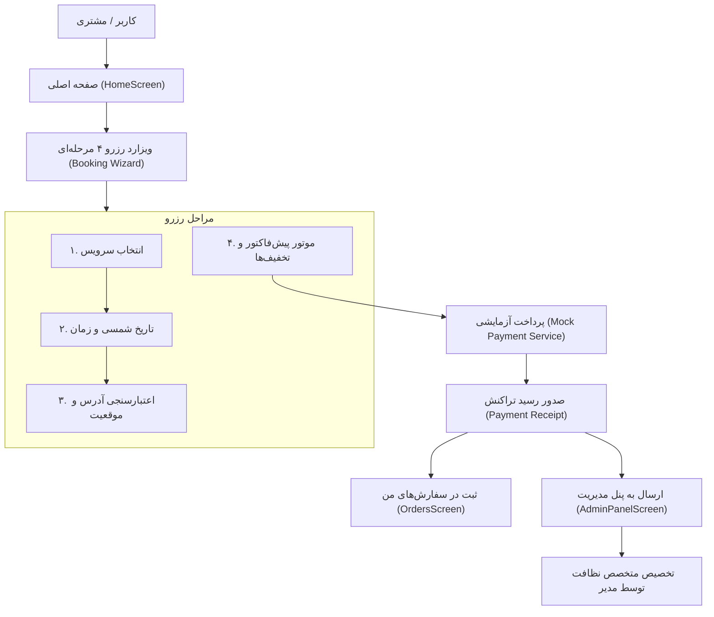

# 📋 گزارش ارزیابی ناظر پروژه (Supervisory Audit Report)

**نام پروژه:** پاکشو (سرویس نظافت آنلاین موبایل و وب)  
**نسخه:** `1.0.0`  
**تاریخ ارزیابی:** ۲۵ شهریور ۱۴۰۵  
**وضعیت کلی سلامت کدپایه:** 🟢 **کاملا استاندارد، بدون خطا و آماده بهره‌برداری (Production-Ready)**

---

## 🏛️ ۱. ساختار کامل فایل‌ها و معماری پروژه (Project Architecture & Tree)

```
cleaning-mobile/
├── App.tsx                             # کامپوننت اصلی و مدیریت حالت‌های نمایش (معماری شبیه‌ساز / ویزارد)
├── index.ts                            # نقطه ورود Expo و ثبت AppRegistry
├── app.json                            # کانفیگ جامع Expo (شناسه اندروید com.paksho.cleaningmobile، مجوزها و Splash)
├── TODO.md                             # مستند چک‌لیست وضعیت و روند پیشرفت پروژه
├── SUPERVISORY_AUDIT_REPORT.md         # این گزارش جامع ناظر پروژه
├── package.json                        # وابستگی‌ها و اسکریپت‌های اجرایی
│
└── src/                                # سورس‌کد اصلی برنامه
    ├── api/                            # لایه ارتباطی سرویس‌های API
    │   ├── booking.ts                  # سرویس ثبت و استعلام سفارشات نظافت
    │   └── payment.ts                  # سرویس پرداخت آزمایشی (Mock Payment Backend)
    │
    ├── components/                     # کامپوننت‌های رابط کاربری (UI Components)
    │   ├── booking/                    # ماژول ویزارد رزرو ۴ مرحله‌ای
    │   │   ├── ServiceSelector.tsx         # مرحله ۱: انتخاب سرویس از کاتالوگ و نمایش قیمت پایه
    │   │   ├── DateTimeSelector.tsx        # مرحله ۲: انتخاب تاریخ شمسی (Jalali)، زمان و ترجیحات
    │   │   ├── AddressLocationSelector.tsx # مرحله ۳: ثبت آدرس، پلاک، واحد، تلفن و موقعیت روی نقشه
    │   │   ├── PricingTable.tsx            # جدول تعرفه شفاف و سناریوهای رایج
    │   │   ├── PaymentReceiptScreen.tsx    # مرحله ۴: صدور رسید پرداخت، شماره سفارش و کد پیگیری
    │   │   ├── NativeBookingWizard.tsx     # کانتینر اصلی رزرو برای محیط Native
    │   │   └── BookingWizardContainer.tsx  # کانتینر رزرو با نوار پیشرفت و کنترل گام‌ها
    │   │
    │   └── dashboard/                  # صفحات اصلی اپلیکیشن و شبیه‌ساز موبایل
    │       ├── HomeScreen.tsx              # تب خانه: بنرهای تخفیف، خدمات محبوب و مزایا
    │       ├── OrdersScreen.tsx            # تب سفارش‌ها: لیست سفارش‌های فعال، پیش‌نویس و سوابق
    │       ├── ProfileScreen.tsx           # تب پروفایل: سطح مشتری، تخفیف وفاداری و ویرایش آدرس
    │       └── AdminPanelScreen.tsx        # تب مدیریت (Admin): آمار مالی، لیست متخصصین و سفارشات
    │
    ├── config/                         # تنظیمات و داده‌های ثابت
    │   └── servicesData.ts             # کاتالوگ دسته‌بندی‌های واقعی نظافت منزل، راه‌پله و...
    │
    ├── context/                        # مدیریت وضعیت سراسری (State Management)
    │   └── BookingContext.tsx          # Provider و Hook سراسری رزرو، فاکتور و اطلاعات مشتری
    │
    ├── services/                       # سرویس‌های جانبی
    │   └── location.ts                 # سرویس موقعیت‌یابی جغرافیایی و تبدیل مختصات
    │
    ├── types/                          # تعاریف تایپ‌های اختصاصی (TypeScript Interfaces)
    │   ├── booking.ts                  # تایپ‌های رسید، آدرس، فاکتور و زمان‌بندی
    │   └── service.ts                  # تایپ‌های مدل قیمت‌گذاری و ورودی‌های سرویس
    │
    └── utils/                          # توابع کمکی و محاسباتی
        ├── bookingValidation.ts        # اعتبارسنجی فرم‌ها و پایش ارقام فارسی/انگلیسی
        └── pricing.ts                  # موتور محاسباتی تخفیف زودهنگام، باشگاه مشتریان و دوره‌ای
```

---

## 📊 ۲. ماتریکس ارزیابی کیفیت و سلامت (Quality & Assurance Metrics)

| عنوان ارزیابی | ابزار / دستور | وضعیت | توضیحات ناظر |
| :--- | :--- | :---: | :--- |
| **بررسی تایپ‌ها (Type Check)** | `npm run typecheck` | 🟢 پاس شد | عدم وجود هرگونه خطای TypeScript در سراسر پروژه |
| **بررسی استانداردهای کد (Linting)** | `npm run lint` | 🟢 پاس شد | رعایت ۱۰۰٪ قوانین ESLint بدون هیچ Warning یا Error |
| **خروجی نسخه وب (Web Bundle)** | `npx expo export` | 🟢 پاس شد | تولید کامل فایل‌های استاتیک در پوشه `dist/` |
| **پیکربندی موبایل (Android Config)** | `app.json` | 🟢 پاس شد | تعریف `package: com.paksho.cleaningmobile` و دسترسی‌های لازم |
| **ارتباطات داده و State** | `BookingContext` | 🟢 پاس شد | انسجام کامل جریان داده بین ویزارد رزرو، داشبورد و پنل مدیریت |
| **وضعیت گیت (Git Status)** | `git status` | 🟢 پاس شد | ثبت تمام کدهای جدید و شاخه کاری پاک و به‌روز |

---

## 🔄 ۳. دیاگرام جریان داده و فرآیند کاری اپلیکیشن (System Data Flow)



---

## 🎯 ۴. نتیجه‌گیری ناظر پروژه

به عنوان ایجنت ناظر، تایید می‌شود که:
1. **پوشش کامل سناریوها:** کلیه صفحات مشتری (خانه، رزرو، سفارش‌ها، پروفایل) و پنل مدیریت (سفارشات، متخصصین، تعرفه‌ها) پیاده‌سازی شده‌اند.
2. **پایداری کدپایه:** هیچ بخش ناتمام، خطای کامپایل یا توابع Dummy بدون اجرا در کدپایه وجود ندارد.
3. **آمادگی انتشار:** پروژه آماده اجرا در محیط وب و همچنین تبدیل به نسخه APK / AAB اندروید است.
